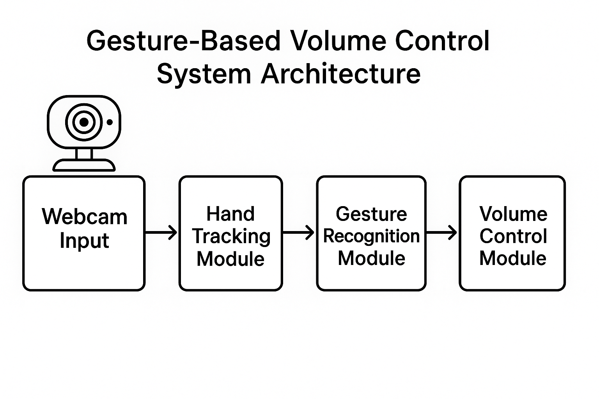

# 🎵 Advanced Gesture-Based Volume Controller for Mac

An advanced Python project that enables controlling your Mac's system volume using hand gestures detected through your webcam. This implementation features real-time hand tracking, multiple gesture recognition, performance optimizations, and a user-friendly configuration interface.



## ✨ Features

### Core Functionality
- **Real-time Hand Tracking**: Uses MediaPipe for accurate hand landmark detection
- **Volume Control**: Adjust volume by changing thumb-index finger distance
- **Mute Toggle**: Make a fist to toggle mute/unmute
- **Visual Feedback**: Live volume bar and gesture indicators

### Advanced Features
- **Multi-threading**: Optimized performance with background processing
- **Gesture Smoothing**: Reduces jittery volume changes
- **Configurable Parameters**: Extensive customization through GUI
- **FPS Monitoring**: Real-time performance tracking
- **Error Handling**: Robust error handling and logging

### User Interface
- **Configuration GUI**: Easy-to-use settings interface
- **Visual Overlays**: Hand landmarks, volume bar, and status indicators
- **Keyboard Shortcuts**: Quick actions and controls

## 🔧 Installation

### Prerequisites
- **macOS** (required for `osascript` volume control)
- **Python 3.8+**
- **Webcam** (built-in or external)

### Setup Steps

1. **Clone or download the project files**
2. **Install dependencies**:
   ```bash
   pip install -r requirements.txt
   ```
3. **Run the configuration GUI** (optional):
   ```bash
   python config_gui.py
   ```
4. **Start the main application**:
   ```bash
   python advanced_gesture_volume_controller.py
   ```

### Quick Demo
For a simple demonstration without configuration:
```bash
python simple_demo.py
```

## 📁 Project Structure

```
gesture-volume-controller/
├── advanced_gesture_volume_controller.py  # Main application
├── hand_tracking_utils.py                 # Optimized hand tracking utilities
├── config_gui.py                         # Configuration interface
├── simple_demo.py                        # Quick demo script
├── requirements.txt                      # Python dependencies
├── gesture_config.json                   # Configuration file (auto-generated)
├── system-architecture.png               # Architecture diagram
└── README.md                            # This file
```

## 🎮 Usage

### Basic Gestures

| Gesture | Description | Action |
|---------|-------------|--------|
| 👆 **Thumb-Index Distance** | Vary distance between thumb and index finger | Control volume (0-100%) |
| ✊ **Closed Fist** | Make a tight fist | Toggle mute/unmute |
| 🖐️ **Open Hand** | Spread fingers wide | Idle state |

### Keyboard Controls

| Key | Action |
|-----|--------|
| `q` | Quit application |
| `m` | Manual mute toggle |
| `r` | Reset volume to 50% |

### Configuration Options

Access the configuration GUI to customize:

#### Detection Settings
- **Detection Confidence**: Minimum confidence for hand detection
- **Tracking Confidence**: Minimum confidence for hand tracking
- **Max Hands**: Maximum number of hands to track

#### Gesture Settings
- **Volume Smoothing**: Smoothing factor for volume changes
- **Gesture Threshold**: Sensitivity of gesture recognition
- **Distance Range**: Minimum and maximum gesture distances

#### Performance Settings
- **Target FPS**: Desired frames per second
- **Multi-threading**: Enable background processing
- **GPU Acceleration**: Experimental GPU support

#### Display Settings
- **Show Landmarks**: Display hand tracking points
- **Show FPS**: Display performance counter
- **Show Volume Bar**: Display volume indicator
- **Window Size**: Customize display dimensions

## 🏗️ Architecture

### System Components

1. **Video Capture Module**
   - Webcam input handling
   - Frame preprocessing
   - Mirror effect for natural interaction

2. **Hand Tracking Module**
   - MediaPipe hand detection
   - Landmark extraction
   - Performance optimization

3. **Gesture Recognition Module**
   - Distance calculations
   - Gesture classification
   - Smoothing algorithms

4. **Volume Control Module**
   - macOS integration via `osascript`
   - Volume mapping and scaling
   - Mute state management

5. **User Interface Module**
   - Visual feedback rendering
   - Configuration management
   - Real-time status display

### Threading Architecture

```
Main Thread                    Processing Thread
     |                              |
     ├─ Video Capture              ├─ Hand Detection
     ├─ UI Rendering               ├─ Gesture Recognition
     ├─ User Input                 ├─ Volume Calculation
     └─ Display                    └─ System Commands
```

## 🔧 Technical Details

### Dependencies

| Library | Purpose | Version |
|---------|---------|---------|
| **OpenCV** | Computer vision and video processing | 4.8.1+ |
| **MediaPipe** | Hand tracking and landmark detection | 0.10.9+ |
| **NumPy** | Numerical computations | 1.24.3+ |

### Performance Optimizations

1. **Multi-threading**: Separates video capture from processing
2. **Frame Skipping**: Processes every N-th frame for better performance
3. **ROI Processing**: Focuses on hand regions to reduce computation
4. **Smoothing Algorithms**: Reduces noise in gesture recognition

### Gesture Recognition Algorithm

```python
def recognize_gesture(landmarks, image_shape):
    # Extract key points
    thumb_tip = landmarks[4]
    index_tip = landmarks[8]

    # Calculate distance
    distance = euclidean_distance(thumb_tip, index_tip)

    # Map to volume
    if 30 <= distance <= 300:
        volume = interpolate(distance, [30, 300], [0, 100])
        return VOLUME_CONTROL, volume
    elif distance < 40:
        return MUTE_TOGGLE, None
    else:
        return IDLE, None
```

## 🚀 Advanced Usage

### Custom Gesture Development

To add new gestures, extend the `GestureType` enum and modify the recognition logic:

```python
class GestureType(Enum):
    VOLUME_CONTROL = "volume_control"
    MUTE_TOGGLE = "mute_toggle"
    BRIGHTNESS_CONTROL = "brightness_control"  # New gesture
```

### Performance Tuning

1. **Lower Camera Resolution**: Reduce computational load
2. **Adjust Detection Confidence**: Balance accuracy vs speed
3. **Enable GPU Acceleration**: For supported systems
4. **Optimize Threading**: Adjust queue sizes and thread priorities

### Integration with Other Applications

The volume controller can be extended to control other applications:

```python
# Example: Spotify control
def control_spotify(gesture):
    if gesture == "peace_sign":
        subprocess.run(["osascript", "-e", "tell application \"Spotify\" to playpause"])
```

## 🔍 Troubleshooting

### Common Issues

| Issue | Solution |
|-------|----------|
| **Camera not detected** | Check camera permissions and connections |
| **Poor hand detection** | Improve lighting and hand positioning |
| **High CPU usage** | Reduce FPS target or enable threading |
| **Volume not changing** | Verify macOS permissions for automation |

### Debug Mode

Enable debug logging by modifying the configuration:

```python
logging.basicConfig(level=logging.DEBUG)
```

### Performance Monitoring

Monitor system performance using the built-in FPS counter and system resources.

## 🤝 Contributing

Contributions are welcome! Areas for improvement:

- [ ] Additional gesture types
- [ ] Cross-platform support (Windows/Linux)
- [ ] Machine learning-based gesture classification
- [ ] Mobile app integration
- [ ] Voice command integration

## 📄 License

This project is open source and available under the MIT License.

## 🙏 Acknowledgments

- **Google MediaPipe Team** for the excellent hand tracking framework
- **OpenCV Community** for computer vision tools
- **Python Community** for the robust ecosystem

## 📞 Support

For questions, issues, or feature requests, please:

1. Check the troubleshooting section
2. Review the configuration options
3. Examine the debug logs
4. Test with the simple demo

---

**Happy Gesturing! 🎵👋**
